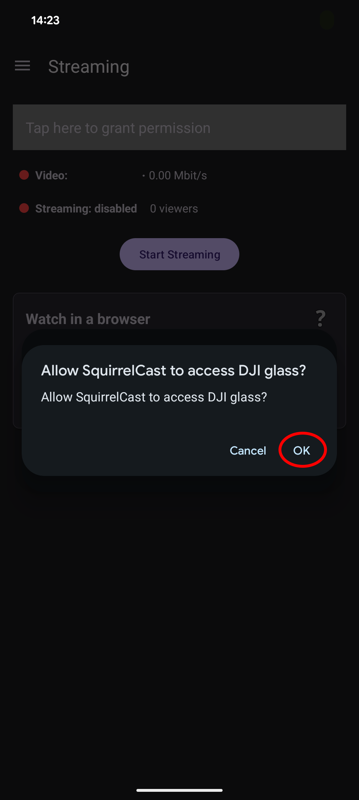
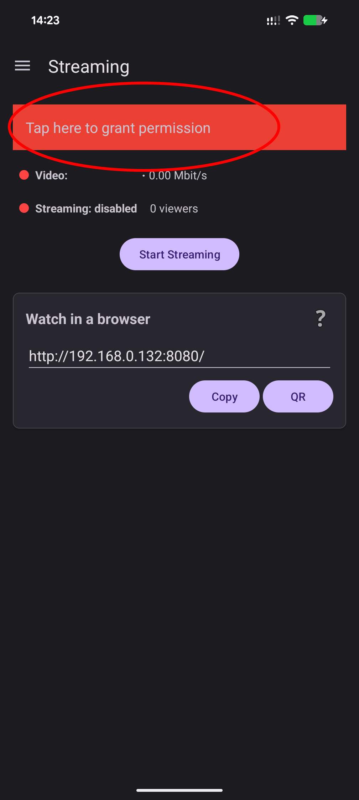
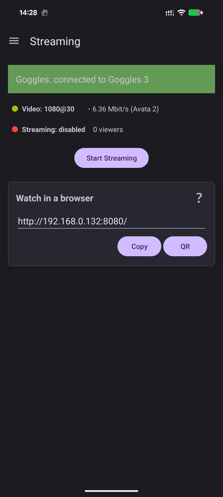
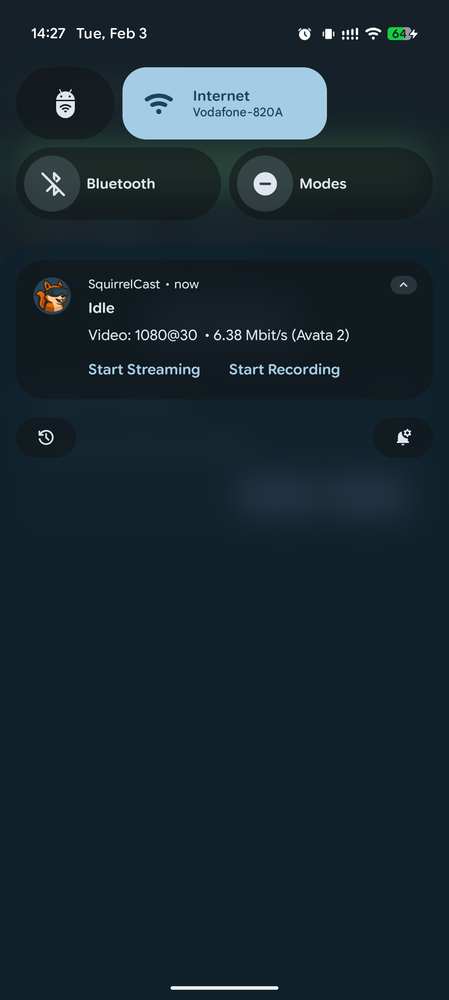

# Connecting to the Goggles

## USB Connection and Permissions

1. Connect your phone to the DJI goggles using a **USB-C cable**.
2. When Android shows the USB permission prompt, tap **Allow** to let SquirrelCast access the goggles.

  
  

If you accidentally deny the permission, SquirrelCast cannot connect. Tap the in-app button to show the permission prompt again.

> **Note:** **DJI Fly must be closed** while using SquirrelCast. The goggles can only connect to one app at a time.  
> If DJI Fly opens automatically, switch to **DJI Fly**, fully close it (remove it from recent apps), then return to **SquirrelCast** and grant the permission again.

## Connection Status

The streaming tab will show the status of the connection:
- Shows a successful connection to the goggles.
- Whether the goggles are actively receiving video from an aircraft/drone.
- When the goggles are receiving video, there is also a notification showing the status.

  
  
  

