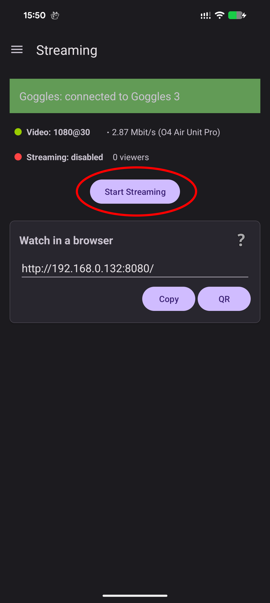
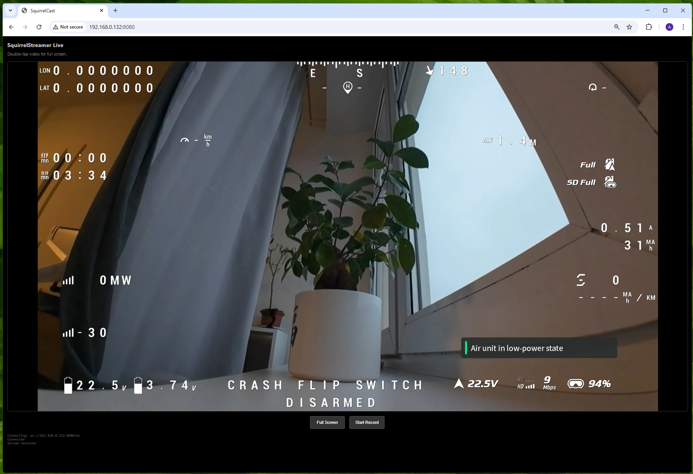

# Streaming Video Over Wi-Fi

The main feature of SquirrelCast is video streaming over a local Wi-Fi network. Most Android phones do not support HDMI output while also receiving video data over USB at the same time. Streaming over the local network is the next best way to get the live feed onto a bigger screen.

SquirrelCast offers two main streaming paths:
- **Stream to a browser** directly via **WebRTC**
- **Stream to third-party apps** via **RTSP**

There is also a third option for newer goggles:
- **Stream directly from the goggles to Windows** using the goggles’ built-in Wi-Fi sharing  
  This only requires SquirrelCast for the initial setup, then it works without the app.

## Stream to a browser (WebRTC)

This is the default streaming option.

Once live video is received in the Player, tap **Start Streaming** to enable streaming.

To view the stream, any device on the same Wi-Fi network can open a browser and enter the IP address shown in the app (or click QR to open a QR code and scan the QR). This opens a page with a live player and a recording option.

  
  

> **Notes**
>
> - In the field, when no Wi-Fi network is available, a Wi-Fi hotspot created by the streaming phone will work as well.
> - Stream quality depends on network quality. On newer phones it is usually good enough, but on older phones the stream can contain stutters and glitches due to network jitter and packet loss.
> - Putting the phone into flight mode to prevent other traffic can help (as long as Wi-Fi stays enabled).
> - If you change network settings on the streaming phone, the stream needs to be restarted.
> - Sometimes the receiver can time out, if that happens, simply reload the page.
