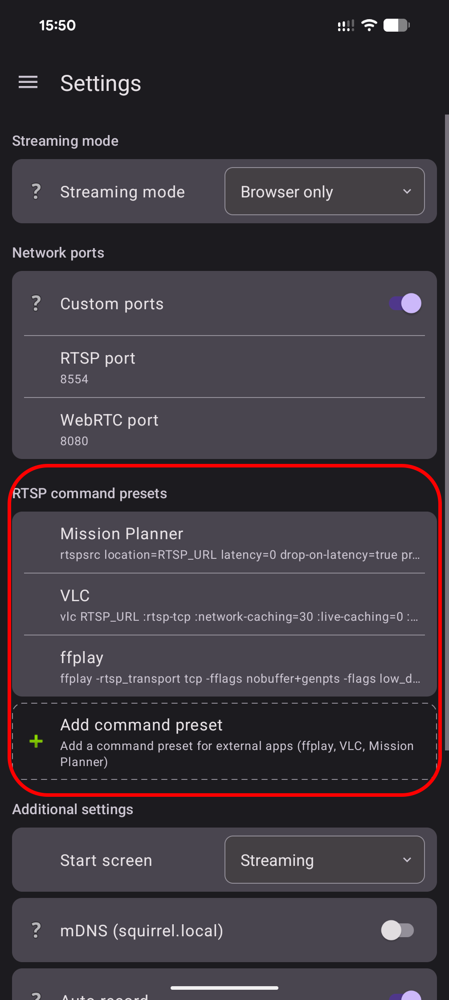
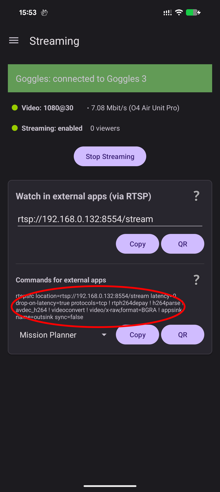

# Streaming Video Over Wi-Fi

The main feature of SquirrelCast is video streaming over a local Wi-Fi network. Most Android phones do not support HDMI output while also receiving video data over USB at the same time. Streaming over the local network is the next best way to get the live feed onto a bigger screen.

SquirrelCast offers two main streaming paths:
- **Stream to a browser** directly via **WebRTC**
- **Stream to third-party apps** via **RTSP**

There is also a third option for newer goggles:
- **Stream directly from the goggles to Windows** using the goggles’ built-in Wi-Fi sharing  
  This only requires SquirrelCast for the initial setup, then it works without the app.

## Stream to a browser (WebRTC)

This is the default streaming option.

Once live video is received in the Player, tap **Start Streaming** to enable streaming.

To view the stream, any device on the same Wi-Fi network can open a browser and enter the IP address shown in the app (or click QR to open a QR code and scan the QR). This opens a page with a live player and a recording option.

  
  

> **Notes**
>
> - In the field, when no Wi-Fi network is available, a Wi-Fi hotspot created by the streaming phone will work as well.
> - Stream quality depends on network quality. On newer phones the hotspot is usually good enough, but on older phones the stream can contain stutters and glitches due to network jitter and packet loss.
> - Putting the phone into flight mode to prevent other traffic can help (as long as Wi-Fi stays enabled).
> - If you change network settings on the streaming phone, the stream needs to be restarted.
> - Sometimes the receiver can time out, if that happens, simply reload the page.

## Stream to third-party apps (RTSP)

Streaming via RTSP is off by default and needs to be enabled in the settings first.

Once enabled, the RTSP URL will be shown on the Streaming tab.

Depending on the app used to receive the RTSP stream, a specific launch command might be needed. SquirrelCast provides commands for a few apps, and users can add more in the settings.

  
  

### Set up ArduPilot Mission Planner

1. Open Mission Planner.
2. Right click the HUD and select **Video** → **Set Gstreamer Source**.
3. In the window that opens, paste the command preset for Mission Planner from the SquirrelCast Streaming tab.

  
  
  

4. Press **OK**. After a few seconds, the video should appear automatically.

> **Note:** If the image looks distorted, right click the video and adjust the aspect ratio.

### Clean video feed (no MSP OSD)

If you want a clean video feed (without MSP OSD), turn off overlays in the goggles:  
**Settings** → **Camera** → **Additional Camera Settings** → **Camera View Recording** → **Off**.

  
  

## Stream directly from the goggles to Windows using SquirrelReceiver

**SquirrelReceiver** is an additional Windows tool that receives video directly from the goggles using the built-in wireless sharing feature, without SquirrelCast running. It is **not** an alternative RTSP receiver at the moment.

SquirrelReceiver can be downloaded from its GitHub releases page:  
https://github.com/xNuclearSquirrel/SquirrelReceiver

### Install and unlock SquirrelReceiver

1. Install SquirrelReceiver on Windows and open **Settings**.
2. In SquirrelCast, open the **Utilities** tab.
3. Select the **Unlock** button and scan the QR code shown in SquirrelReceiver to generate a license key and unlock SquirrelReceiver.

### Configure goggles Wi-Fi

1. Connect SquirrelCast to the goggles.
2. In SquirrelCast, open the **Utilities** tab and configure the goggles Wi-Fi network (or leave the default network, but note down the password).

### Enable Live View sharing

On the goggles, enable Live View sharing (pull down on the 5-position stick and enable Live View sharing).

  

### Connect Windows to the goggles Wi-Fi

1. On the Windows PC, connect to the goggles Wi-Fi network.
2. The stream should start automatically in SquirrelReceiver.

  
  

